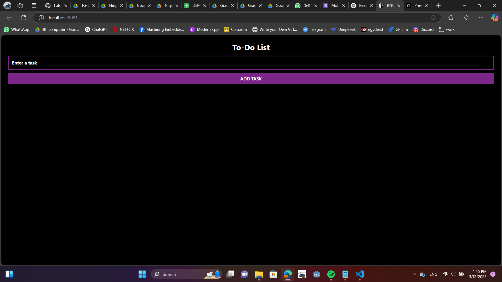
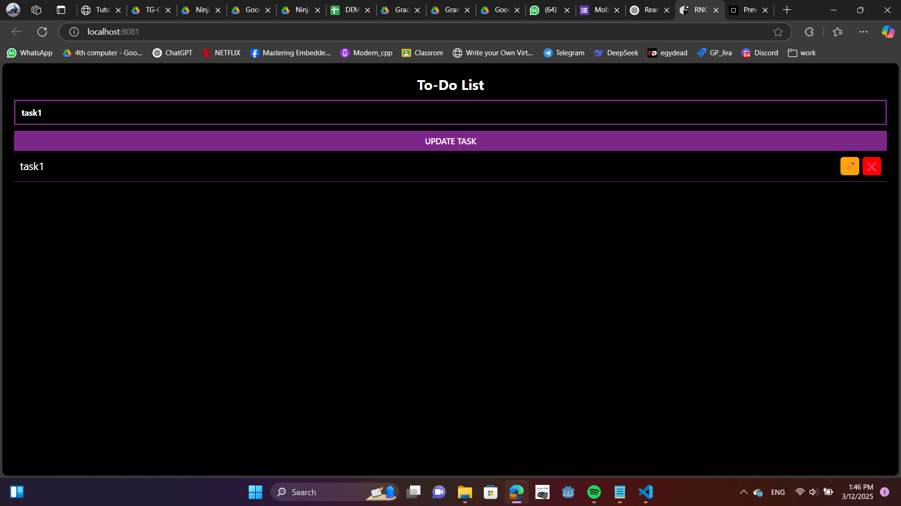

# lab 2
## online compiler link
https://codesandbox.io/p/devbox/agitated-ace-vjf2kd?workspaceId=ws_JQbqGnwrH2NZkuQsobLimv

https://codesandbox.io/p/devbox/agitated-ace-vjf2kd

## Screenshots





## code

```js
import React, { useState } from "react";
import { View, Text, TextInput, Button, FlatList, TouchableOpacity, StyleSheet } from "react-native";

export default function App() {
  const [task, setTask] = useState(""); // Stores new task input
  const [tasks, setTasks] = useState([]); // Stores task list
  const [editingIndex, setEditingIndex] = useState(null); // Tracks task being edited

  function addTask() {
    if (task.trim() !== "") {
      if (editingIndex !== null) {
        // Edit existing task
        const updatedTasks = [...tasks];
        updatedTasks[editingIndex] = task;
        setTasks(updatedTasks);
        setEditingIndex(null);
      } else {
        // Add new task
        setTasks([...tasks, task]);
      }
      setTask(""); // Clear input
    }
  }

  function deleteTask(index) {
    setTasks(tasks.filter((_, i) => i !== index)); // Remove task by index
  }

  function editTask(index) {
    setTask(tasks[index]); // Set input to selected task text
    setEditingIndex(index); // Store index of task being edited
  }

  return (
    <View style={styles.container}>
      <Text style={styles.title}>To-Do List</Text>
      
      <TextInput
        style={styles.input}
        placeholder="Enter a task"
        value={task}
        onChangeText={setTask}
      />

      <Button 
        title={editingIndex !== null ? "Update Task" : "Add Task"} 
        onPress={addTask} 
        color="#7D2689" 
      />
      
      <FlatList
        data={tasks}
        renderItem={({ item, index }) => (
          <View style={styles.taskContainer}>
            <Text style={styles.task}>{item}</Text>
            <TouchableOpacity style={styles.editButton} onPress={() => editTask(index)}>
              <Text style={styles.buttonText}>✏️</Text>
            </TouchableOpacity>
            <TouchableOpacity style={styles.deleteButton} onPress={() => deleteTask(index)}>
              <Text style={styles.buttonText}>❌</Text>
            </TouchableOpacity>
          </View>
        )}
        keyExtractor={(item, index) => index.toString()}
      />
    </View>
  );
}

const styles = StyleSheet.create({
  container: { flex: 1, padding: 20, justifyContent: "center", backgroundColor: "black" },
  title: { fontSize: 24, fontWeight: "bold", marginBottom: 10, color: "white", textAlign: "center" },
  input: { borderWidth: 3, padding: 10, marginBottom: 10, borderColor: "#7D2689", color: "white", fontWeight: "bold" },
  taskContainer: { flexDirection: "row", alignItems: "center", justifyContent: "space-between", padding: 10, borderBottomWidth: 1, borderColor: "#7D2689" },
  task: { fontSize: 18, color: "white", flex: 1 },
  editButton: { backgroundColor: "#FFA500", padding: 5, borderRadius: 5, marginHorizontal: 5 },
  deleteButton: { backgroundColor: "#FF0000", padding: 5, borderRadius: 5 },
  buttonText: { color: "white", fontSize: 16 },
});


```

## Colors and fonts
### colors
1. violet **#7D2689**
2. white
3. black

### fonts
default
